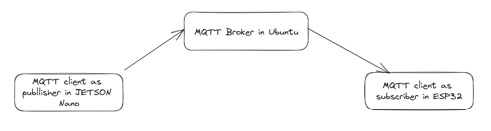

# Install and setup Mosquitto MQTT broker in Ubuntu environment

We need to install Mosquitto MQTT broker in Ubuntu environment.

# then install Eclipse Paho MQTT C++ library for the client application
https://github.com/eclipse/paho.mqtt.cpp

